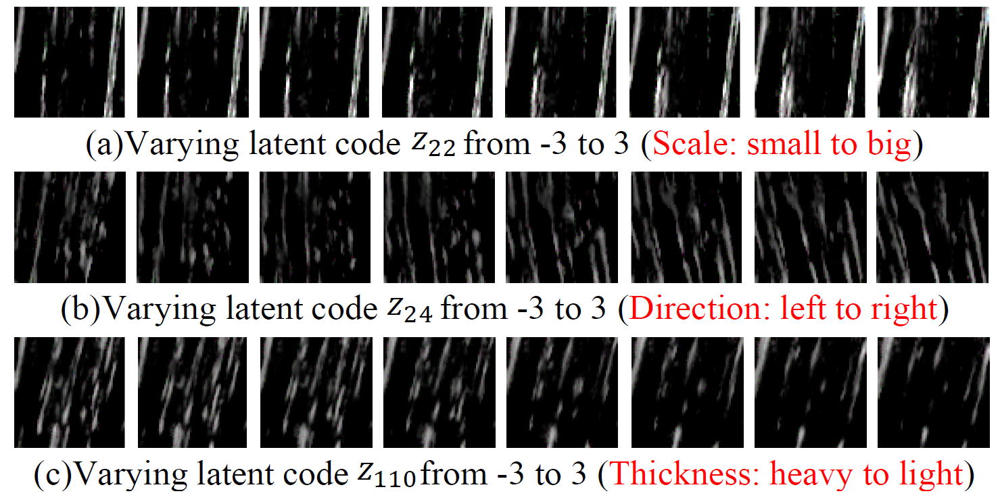
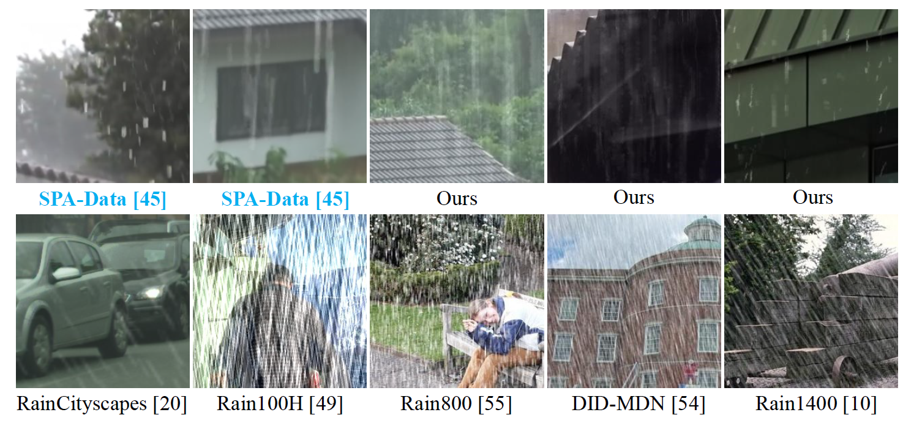
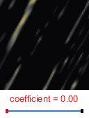
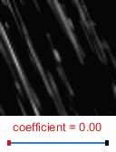
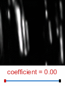
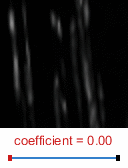
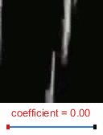

# From Rain Generation to Rain Removal (CVPR2021)
 
[Hong Wang](https://hongwang01.github.io/), [Zongsheng Yue](https://github.com/zsyOAOA), Qi Xie, Qian Zhao, [Yefeng Zheng](https://sites.google.com/site/yefengzheng), and [Deyu Meng](http://gr.xjtu.edu.cn/web/dymeng)  

[[PDF&&Supplementary Material]](https://arxiv.org/pdf/2008.03580.pdf)


## Abstract
For the single image rain removal (SIRR) task, the performance of deep learning (DL)-based methods is mainly affected by the designed deraining models and training datasets. Most of current state-of-the-art focus on constructing powerful deep models to obtain better deraining results. In this paper, to further improve the deraining performance, we novelly attempt to handle the SIRR task from the perspective of training datasets by exploring a more efficient way to synthesize rainy images. Specifically, we build a full Bayesian generative model for rainy image where the rain layer is parameterized as a generator with the input as some latent variables representing the physical structural rain factors, e.g., direction, scale, and thickness. To solve this model, we employ the variational inference framework to approximate the expected statistical distribution of rainy image in a data-driven manner. With the learned generator, we can automatically and sufficiently generate diverse and non-repetitive training pairs so as to efficiently enrich and augment the existing benchmark datasets. User study qualitatively and quantitatively evaluates the realism of generated rainy images. Comprehensive experiments substantiate that the proposed model can faithfully extract the complex rain distribution that not only helps significantly improve the deraining performance of current deep single image derainers, but also largely loosens the requirement of large training sample pre-collection for the SIRR task.

## Dependicies

pip install -r requirements.txt

## Folder Directory 
```
.
|-- for_spa                                   : Experiments on real SPA-Data
|   |-- data                                  : SPA-Data: train + test
|   |   `-- spa-data 
|   |       |-- real_world              
|   |       |-- real_world.txt
|   |       |-- real_world_gt
|   |       `-- test  
|   |-- train_spa_joint.py                    : Joint training on SPA-Data
|   |-- train_spa_aug.py                      : Augmentated training
|   |-- train_spa_smallsample_aug.py          : Small sample experiments (GNet in Table 1)
|   |-- train_spa_smallsample_noaug.py        : Small sample experiments (Baseline in Table 1)
|   |-- test_disentanglement.py               : Distentanglement experiments on SPA-Data
|   |-- test_interpolation.py                 : Interpolation experiments on SPA-Data
|   |-- spamodels                             : Joint pretrained model on SPA-Data

|-- for_syn                                   : Experiments on synthesized datasets
|   |-- data                                  : Synthesized datasets: train + test
|   |   |-- rain100H
|   |   |   |-- test
|   |   |   `-- train
|   |   |-- rain100L
|   |   |   |-- test
|   |   |   `-- train
|   |   `-- rain1400
|   |       |-- test
|   |       `-- train
|   |-- train_syn_joint.py                    : Joint training
|   |-- train_syn_aug.py                      : Augmentated training in Table 2
|   |-- test_disentanglement.py               : Distentanglement experiments
|   |-- test_interpolation.py                 : Interpolation experiments 
|   |-- syn100hmodels                         : Joint pretrained model on rain100H
|   |-- syn100lmodels                         : Joint pretrained model on rain100L
|   |-- syn1400models                         : Joint pretrained model on rain1400
```
## Benchmark Dataset
Synthetic datasets: Rain100L, Rain100H, Rain1400

Real datasets: SPA-Data, Internet-Data（only for testing）
 
Detailed descriptions refer to [the Survey, SCIENCE CHINA Information Sciences2021](https://github.com/hongwang01/Video-and-Single-Image-Deraining)

Please refer to [RCDNet, CVPR2020](https://github.com/hongwang01/RCDNet) for downloading these datasets and put them into the corresponding folders according to the dictionary above. 

## For Synthetic Dataset (*taking Rain100L as an example*)
### Training
Step 1.  Joint Training:
```
$ cd ./VRGNet/for_syn/ 
$ python train_syn_joint.py  --data_path "./data/rain100L/train/small/rain" --gt_path "./data/rain100L/train/small/norain" --log_dir "./syn100llogs/" --model_dir "./syn100lmodels/" --gpu_id 0  
```
Step 2. Augmentated Training: (*taking baseline PReNet as an example*)
```
$ python train_syn_aug.py  --data_path "./data/rain100L/train/small/rain" --gt_path "./data/rain100L/train/small/norain" --netED "./syn100lmodels/ED_state_700.pt" --log_dir "./aug_syn100llogs/" --model_dir "./aug_syn100lmodels/" --fake_ratio 0.5 --niter 200 --gpu_id 0  
```
### Testing
1. Joint Testing:
```
$ python test_syn_joint.py  --data_path "./data/rain100L/test/small/rain" --netDerain "./syn100lmodels/DerainNet_state_700.pt" --save_path "./derained_results/rain100L/" --gpu_id 0  
```
2. Augmentated Testing: (*taking baseline PReNet as an example*)
```
$ python test_syn_aug.py  --data_path "./data/rain100L/test/small/rain" --model_dir "./aug_syn100lmodels/Aug_DerainNet_state_200.pt" --save_path "./aug_derained_results/rain100L/" --gpu_id 0  
```
3. Interpolation Testing:
```
$ python test_interpolation.py   --data_path "./interpolation_results/test_data/rain100L/rain" --gt_path "./interpolation_results/test_data/rain100L/norain" --netED "./syn100lmodels/ED_state_700.pt"  --save_patch "./interpolation_results/test_data/rain100L/crop_patch/" --save_inputfake "./interpolation_results/generated_data/rain100L/input_fake" --save_rainfake "./interpolation_results/generated_data/rain100L/rain_fake" --gpu_id 0  
```
4. Disentanglement Testing:
```
$ python test_disentanglement.py  --netED "./syn100lmodels/ED_state_700.pt" --save_fake "./disentanglement_results/rain100L/" --gpu_id 0  
```

## For SPA-Data
### Training
Step 1.  Joint Training:
```
$ cd ./VRGNet/for_spa/ 
$ python train_spa_joint.py  --data_path "./data/spa-data/" --log_dir "./spalogs/" --model_dir "./spamodels/" --gpu_id 0  
```
Step 2. Augmentated Training: (*taking baseline PReNet as an example*)
```
$ python train_spa_aug.py  --data_path "./data/spa-data/" --netED "./spamodels/ED_state_800.pt" --log_dir "./aug_spalogs/" --model_dir "./aug_spamodels/" --fake_ratio 0.5 --niter 200 --gpu_id 0  
```
Step 3. Small Sample Training: (*taking baseline PReNet as an example*)
```
$ python train_spa_smallsample_aug.py  --data_path "./data/spa-data/" --netED "./spamodels/ED_state_800.pt" --fake_ratio 0.5 --train_num 1000 --log_dir "./aug05_spalogs/" --model_dir "./aug05_spamodels/" --niter 200 --gpu_id 0  
```

```
$ python train_spa_smallsample_noaug.py  --data_path "./data/spa-data/" --fake_ratio 0.5 --train_num 1000 --log_dir "./noaug05_spalogs/" --model_dir "./noaug05_spamodels/" --niter 200 --gpu_id 0  
```

### Testing
1. Joint Testing:
```
$ python test_spa_joint.py  --data_path "./data/spa-data/test/small/rain" --netDerain "./spamodels/DerainNet_state_800.pt" --save_path "./derained_results/spa-data/" --gpu_id 0  
```
2. Augmentated Testing: (*taking baseline PReNet as an example*)
```
$ python test_spa_aug.py  --data_path "./data/spa-data/test/small/rain" --model_dir "./aug_spamodels/Aug_DerainNet_state_200.pt" --save_path "./aug_derained_results/spa-data/" --gpu_id 0  
```
3. Interpolation Testing:
```
$ python test_interpolation.py   --data_path "./interpolation_results/test_data/spa-data/rain" --gt_path "./interpolation_results/test_data/spa-data/norain" --netED "./spamodels/ED_state_800.pt"  --save_patch "./interpolation_results/test_data/spa-data/crop_patch/" --save_inputfake "./interpolation_results/generated_data/spa-data/input_fake" --save_rainfake "./interpolation_results/generated_data/spa-data/rain_fake" --gpu_id 0  
```
4. Disentanglement Testing:
```
$ python test_disentanglement.py  --netED "./spamodels/ED_state_800.pt" --save_fake "./disentanglement_results/spa-data/" --gpu_id 0  
```

5. Small Sample Testing: (*taking baseline PReNet as an example*)
```
$ python test_spa_aug.py  --data_path "./data/spa-data/test/small/rain" --model_dir "./aug05_spamodels/Aug05_DerainNet_state_200.pt" --save_path "./aug05_derained_results/spa-data/" --gpu_id 0  
```
```
$ python test_spa_aug.py  --data_path "./data/spa-data/test/small/rain" --model_dir "./noaug05_spamodels/NoAug05_DerainNet_state_200.pt" --save_path "./noaug05_derained_results/spa-data/" --gpu_id 0  
```


### For Internet-Data 

The test model is trained on SPA-Data.

## Pretrained Model and Usage
1) We have provided the joint pretrained model saved in ``syn100lmodels``, ``syn100hmodels``, ``syn1400models``, and ``spamodels``. If needed, you can dirctly utilize them to augment the original training set without exectuting the joint training.

2) We only provide the PReNet for an example during the augmented training/testing phase. This is a demo. In practice, you can easily replace PReNet with other deep deraining models as well as yours for further performance improvement by adopting the augmented strategy with our generator. Please note that the training details in ``train_syn_aug.py``and ``train_spa_aug.py``are needed to be correspondingly adjusted.

3) Please note that in our default settings, the generated patchsize is 64x64. In the released code, we also provide the model revision (i.e., RNet, Generator, and discriminator) for generating the size as 256x256. If other sizes are needed, you can correspondingly revise the network layer and then re-train the joint VRGNet.

## Rain Generation Experiments

<p align="center">&nbsp;&nbsp;&nbsp;&nbsp;</p> 

<p align="center">&nbsp;&nbsp;&nbsp;&nbsp;&nbsp;&nbsp;&nbsp;&nbsp;&nbsp;&nbsp;</p> 


## Rain Removal Experiments
<div  align="center"></div>


## Derained Results of Our VRGNet (i.e., PReNet-)


All PSNR and SSIM results are computed with this [Matlab code](https://github.com/hongwang01/RCDNet/tree/master/Performance_evaluation).
If needed, please download the results from  [NetDisk](https://pan.baidu.com/s/1-W1Q3yOfzMqM2s4WtJN86Q) (pwd:2q6l) 


## Citation
```
@inproceedings{wang2021rain,
  title={From Rain Generation to Rain Removal},
  author={Wang, Hong and Yue, Zongsheng and Xie, Qi and Zhao, Qian and Zheng, Yefeng and Meng, Deyu},
  booktitle={Proceedings of the IEEE/CVF Conference on Computer Vision and Pattern Recognition},
  pages={14791--14801},
  year={2021}
}
```

## Contact
If you have any question, please feel free to concat Hong Wang (Email: hongwang01@stu.xjtu.edu.cn)
